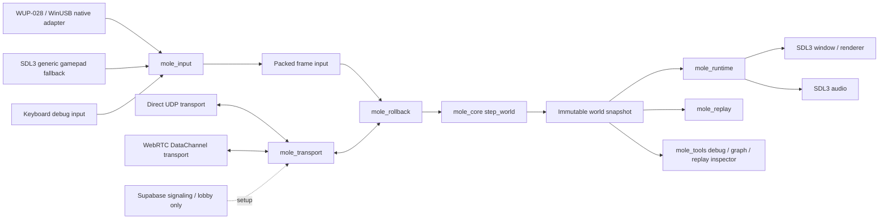

# Native Rust Rollback Architecture And Network Plan

Updated: 2026-05-28

This document is the handoff roadmap for moving Mole from the current Pygame
prototype into a native, low-latency, rollback-ready Rust platform fighter.
It is intended to be readable by a future agent or developer with no memory of
this chat.

## Executive Decision

The project should move toward this architecture:

```text
Native Rust deterministic core
  + SDL3 native runtime shell
  + GameCube/WUP-first input pipeline
  + UCF-native controller normalization
  + custom rollback core shaped by GGRS/GGPO
  + direct UDP first
  + WebRTC DataChannel later
  + Supabase only for lobby/signaling/matchmaking
```

The existing Pygame layer should stop being the long-term mechanics authority.
It can remain as a playable harness and historical reference while the Rust
core becomes the one source of truth for state transitions, physics, input
interpretation, replay, and rollback.

## Current Project State

The repository currently has two gameplay surfaces:

- The legacy playable Pygame prototype: `RealMainFile.py`, `Characters.py`,
  `ChooseAction.py`, `GatherInputs.py`, `NativeWupInput.py`, and related files.
- The newer Rust workspace: `crates/mole_core`, `crates/mole_input`,
  `crates/mole_rollback`, `crates/mole_replay`, `crates/mole_transport`,
  `crates/mole_signaling`, and `crates/mole_runtime`.

Important existing docs:

- `docs/superpowers/specs/2026-05-27-rust-rollback-core-design.md`
- `docs/research/melee-input-state-reference.md`
- `docs/research/melee-common-state-inventory.md`
- `docs/research/mole-state-coverage-comparison.md`
- `docs/research/pygame-movement-logic-pass.md`

The current docs already agree on the strategic direction:

- Rust core is cleaner long term.
- Pygame is a temporary testing surface.
- GameCube controller state should be preserved in native packet shape first.
- UCF-style handling should happen before the engine consumes input.
- Motion-state parity matters more than ad hoc behavior patches.

## Non-Negotiables

1. Fixed simulation rate is 60 Hz.
2. Local input must feel immediate.
3. No default gameplay input buffer.
4. The deterministic core must not depend on rendering, audio, controller APIs,
   sockets, files, wall-clock time, threads, random OS state, or global mutable
   runtime state.
5. Runtime code may drop visual frames, but it must not mutate authoritative
   gameplay outside the core step.
6. Rollback stores compact snapshots, frame-indexed inputs, and checksums.
7. Replays must be able to reproduce a match from initial state plus inputs.
8. Native GameCube input is the first-class controller path.
9. L/R analog trigger pressure and L/R digital bottom-out buttons remain
   distinct.
10. UCF is implemented natively in the input layer, not as a game-mechanics
    patch.
11. Melee and Slippi are behavioral references, not license-free code sources.
12. The architecture must remain no-cost to build, test, run, and share.

## External Reference Conclusions

### Dolphin And Slippi Shape

Dolphin Netplay has direct connection and traversal-server options. Dolphin's
own Netplay guide says traversal is for connectivity and does not add gameplay
latency; the base games remain peer-to-peer. The Dolphin server browser is
lobby infrastructure, not gameplay authority.

References:

- [Dolphin Netplay Guide](https://dolphin-emu.org/docs/guides/netplay-guide/)
- [Dolphin Netplay Server Browser](https://docs.dolphin-emu.org/blog/2019/04/06/netplay-server-browser/)

Slippi adds rollback, matchmaking, replay support, and a Dolphin fork plus
Melee-side ASM/Gecko support. Its public docs and repositories show the pieces,
but not every production matchmaking detail. The useful architectural lesson is
still clear: matchmaking and connection setup can be server-assisted, but the
match simulation and rollback live on the players' machines.

References:

- [Slippi Netplay](https://slippi.gg/netplay)
- [Project Slippi repository](https://github.com/project-slippi/project-slippi)
- [Slippi SSBM ASM repository](https://github.com/project-slippi/slippi-ssbm-asm)

### GGRS Shape

GGRS describes the exact rollback contract we want to mirror: save state, load
state, advance one frame from player inputs, exchange inputs, predict missing
remote input, roll back on mismatch, and detect desyncs with checksums.

Reference:

- [GGRS Rust docs](https://docs.rs/ggrs/latest/ggrs/)

### SDL3 Runtime Shape

SDL3 is a strong native shell for window, event, input, gamepad fallback, and
audio. The Rust `sdl3` crate exists and supports modules for audio, event,
gamepad, joystick, keyboard, render, video, and more. SDL's gamepad docs also
show why generic controllers are useful as a fallback, while our native
GameCube/WUP path remains the first-class path.

References:

- [SDL3 Rust crate](https://docs.rs/sdl3/latest/sdl3/)
- [SDL3 language bindings](https://wiki.libsdl.org/SDL3/LanguageBindings)
- [SDL3 gamepad docs](https://wiki.libsdl.org/SDL3/CategoryGamepad)
- [SDL3 audio docs](https://wiki.libsdl.org/SDL3/CategoryAudio)

### Supabase And WebRTC Shape

Supabase Realtime is WebSocket/server-mediated. It is useful for lobby,
presence, matchmaking queues, room codes, and WebRTC signaling. It should not
carry 60 Hz gameplay inputs.

The free Supabase Realtime limits are currently documented as 200 concurrent
connections and 100 messages per second. A naive two-player 60 Hz input stream
can exceed that message rate by itself.

References:

- [Supabase Realtime limits](https://supabase.com/docs/guides/realtime/limits)
- [Supabase Broadcast docs](https://supabase.com/docs/guides/realtime/broadcast)

WebRTC DataChannels can be peer-to-peer once established. They still need
signaling, and restrictive networks may require TURN relay, which is the part
that can become non-free.

References:

- [MDN WebRTC connectivity](https://developer.mozilla.org/en-US/docs/Web/API/WebRTC_API/Connectivity)
- [MDN WebRTC data channels](https://developer.mozilla.org/en-US/docs/Web/API/WebRTC_API/Using_data_channels)
- [Rust WebRTC data channel docs](https://docs.rs/webrtc/latest/webrtc/data_channel/)

## System Diagram



## Crate Boundaries

### `mole_core`

Purpose: authoritative deterministic game rules.

Owns:

- World state.
- Player state.
- Fixed 60 Hz frame stepping.
- Motion-state identities.
- State-local transition order.
- Character attributes.
- Stage/collision geometry in deterministic units.
- Physics integration.
- Checksum-friendly state representation.

Must not depend on:

- SDL3.
- WinUSB/hidapi/libusb.
- WebRTC.
- UDP sockets.
- Supabase.
- Filesystem.
- Wall-clock time.
- Threads.
- Renderer state.

Core API shape:

```rust
pub fn step_world(world: &mut World, inputs: &[PlayerInput; MAX_PLAYERS]);
pub fn checksum_world(world: &World) -> u64;
```

The exact function names can change, but the boundary should not: the core
advances only from explicit state and explicit frame inputs.

### `mole_input`

Purpose: turn physical controller state into rollback-safe per-frame input.

Owns:

- `GameCubePadStatus` raw packet shape.
- WUP-028 port mapping.
- Console-style origin capture.
- UCF-native input correction.
- Trigger analog deadzone normalization.
- Digital trigger bottom-out facts.
- Stick byte to deterministic fixed-point conversion.
- Previous/current input frame comparison.
- Packed `PlayerInput` for rollback.

Important rule: this crate can know about controller semantics, but not about
motion-state outcomes. It can expose facts such as "fresh dash direction" or
"digital L pressed this frame"; it should not decide "enter Dash state" or
"enter Guard state." The core state machine decides that.

### `mole_rollback`

Purpose: own prediction, snapshots, resimulation, and desync detection.

Owns:

- Snapshot ring buffer.
- Confirmed local/remote inputs.
- Predicted remote inputs.
- Frame cursor.
- Rollback start-frame detection.
- Resimulation forward to present.
- Checksum exchange hooks.
- Prediction policy.
- Optional input-delay setting.

Recommended first prediction policy:

- Repeat last known remote input.
- Fall back to neutral/default if no previous remote input exists.

### `mole_transport`

Purpose: move small frame-indexed packets between peers.

Owns:

- In-memory loopback transport for tests.
- Direct UDP transport.
- Transport trait/interface.
- Later WebRTC DataChannel transport.
- Packet serialization/deserialization.
- Packet versioning.
- Ping/quality stats.
- Connection lifecycle.

Must not own:

- Game physics.
- State transitions.
- Controller normalization.
- Rendering.

### `mole_signaling`

Purpose: exchange setup data for lobbies, room joins, direct endpoints, and
future WebRTC negotiation.

Owns:

- Room create and join messages.
- WebRTC offer, answer, and ICE candidate messages.
- Direct UDP endpoint exchange.
- JSON serialization for setup messages.
- Validation of required setup fields.

Must not own:

- Frame-indexed gameplay input.
- Simulation checksums.
- Rollback prediction or resimulation.
- Any 60 Hz gameplay transport.

### `mole_replay`

Purpose: make every testable match reproducible.

Owns:

- Initial session config.
- Initial world seed/state.
- Build/protocol version.
- Stage/character profile identifiers.
- Per-frame packed inputs.
- Periodic checksums.
- Desync evidence.

Replay files should be small, deterministic, and suitable for regression tests.

### `mole_runtime`

Purpose: native playable shell.

Owns:

- SDL3 initialization.
- Window.
- Renderer.
- Audio device/streams.
- Event loop.
- Generic controller fallback.
- Keyboard debug fallback.
- Native WUP polling bridge.
- Fixed-step accumulator.
- Debug overlays.

Must not own:

- Gameplay state transitions.
- Gameplay physics.
- Rollback policy.
- UCF correction rules.

### `mole_tools`

Purpose: developer and QA tooling.

Owns:

- State graph viewer.
- Replay inspector.
- Input viewer.
- Rollback/desync visualizer.
- Latency/packet debug overlays.

Tools can be Python, Rust, or web-based as convenient. They are not part of the
rollback-critical runtime.

## Authoritative Model

There should be no authoritative gameplay server.

Authority is split like this:

1. Each peer is authoritative over its own local input frames.
2. The deterministic core is authoritative over the resulting world state.
3. The host is authoritative only over session setup:
   - ruleset
   - stage
   - player slots
   - initial seed/config
   - protocol version agreement
4. Once the match begins, peers are symmetrical simulation participants.

Rollback works because all peers execute the same deterministic function over
the same initial state and the same inputs. The network sends inputs, not
world-state deltas.

### Desync Handling

Peers should exchange periodic checksums. If checksums disagree:

1. Mark the session desynced.
2. Save local replay/debug bundle.
3. Show a clear error.
4. Stop ranked/authoritative result reporting for that match.

For early development, hard-stop on desync. Later, tools can compare replay logs
and snapshots to identify the first divergent frame.

### Cheating And Trust

P2P rollback is trust-light, not trustless. A malicious client can lie about
inputs or run a modified build.

Do not solve this early. The first goal is correct feel and deterministic
simulation. Later anti-cheat/ranked integrity can use:

- protocol/build version locking
- replay upload
- checksums
- suspicious timing detection
- server-verified match reports
- community moderation

## Input Architecture

### Native GameCube Path

The first-class path is:

```text
WUP-028 adapter
  -> raw USB report
  -> per-port GameCubePadStatus
  -> console-style origin capture
  -> UCF-native correction
  -> deterministic packed PlayerInput
  -> rollback/core
```

`GameCubePadStatus` should preserve:

- main stick raw X/Y bytes
- C-stick raw X/Y bytes
- analog L trigger byte
- analog R trigger byte
- digital L button
- digital R button
- A/B/X/Y/Z
- Start
- D-pad directions

### Console-Style Origin Capture

GameCube controllers establish neutral/origin from the state seen during
connection/reset. For plug-and-play behavior, the runtime should capture the
first stable connected samples as origin, matching the console-style user
experience.

This origin is not a gameplay mechanic. It is controller preprocessing.

### Trigger Deadzone

Analog triggers should support a configurable lower deadzone, but the current
default can be fixed in data:

```text
raw analog <= deadzone -> 0.0 pressure
raw analog > deadzone -> remap to 0.0..1.0
digital bottom-out -> separate L/R digital button facts
```

This preserves the user's desired safety behavior without patching shield
logic. The input layer changes the analog reading; the game still consumes the
resulting controller state naturally.

### UCF-Native Correction

UCF should be treated as the default native controller pass. It should be
implemented in `mole_input` as a deterministic transformation from raw/current
and previous controller frames into Melee-shaped facts.

The game should not contain special "UCF state hacks." The core should consume
ordinary facts as if the controller behaved correctly.

### Generic Controller Fallback

SDL3 gamepad input is a fallback for non-GameCube controllers. It should map
into the same `PlayerInput` shape but should not define the canonical feel.

GameCube/WUP remains the reference controller.

## Simulation Architecture

### Fixed 60 Hz

The simulation always advances in discrete frames:

```text
frame 0
frame 1
frame 2
...
```

Runtime timing only decides when to call the core. It does not change gameplay
results.

### Deterministic Numbers

Prefer fixed-point or integer world units for authoritative state. Avoid
cross-platform float drift in state that affects gameplay.

Rendering can convert deterministic units to pixels/floats after the snapshot is
produced.

### State-Local Transitions

The state machine should mirror the Melee/decomp shape:

```text
state id
state frame
animation frame
IASA/input callback
physics callback
collision callback
end condition
```

Do not use one giant "choose best action" resolver. Each state owns an ordered
transition function. This is how we prevent accidental same-frame overwrites and
patch stacks.

### Motion State Parity Rule

If a Melee mechanic depends on a named state, Mole should model that state
directly instead of hiding it behind a flag.

Near-term required movement states:

- `Wait`
- `WalkSlow`
- `WalkMiddle`
- `WalkFast`
- `Turn`
- `Dash`
- `Run`
- `RunDirect`
- `RunBrake`
- `TurnRun`
- `Squat`
- `SquatWait`
- `SquatRv`
- `KneeBend`
- `JumpF`
- `JumpB`
- `JumpAerialF`
- `JumpAerialB`
- `Fall`
- `FallF`
- `FallB`
- `FallAerial`
- `FallAerialF`
- `FallAerialB`
- `EscapeAir`
- `FallSpecial`
- `FallSpecialF`
- `FallSpecialB`
- `Landing`
- `LandingFallSpecial`
- `GuardOn`
- `Guard`
- `GuardOff`
- `EscapeN`
- `EscapeF`
- `EscapeB`

Later combat states:

- ground attack family
- aerial attack family
- landing aerial family
- grab/catch/throw/captured families
- damage/hitstun/tumble
- knockdown/tech/passive
- ledge/cliff states
- shield hit/powershield/shield break

### Directional Shield Exception

The project intentionally allows turning while shielding. This is a design
departure from Melee. It should be explicit, isolated, and rollback-owned:

- `Guard` remains Melee-shaped.
- Shield-facing-turn fields are extra Mole state data.
- The extra behavior must not collapse `GuardOn`, `Guard`, and `GuardOff`.
- Leaving shield still follows Melee-shaped shield release timing unless the
  design later changes that deliberately.

## Rollback Architecture

### Snapshot Ring

Store enough snapshots to cover the maximum rollback window plus safety margin.
Initial target:

```text
max rollback frames: 8
snapshot ring capacity: 16 or 32
```

This can change after profiling, but starting compact keeps debugging easier.

### Frame Data

For each frame, store:

- local input
- remote input if confirmed
- remote input if predicted
- prediction status
- world checksum after simulation
- optional network quality stats

### Advance Loop

Every simulation tick:

1. Poll local controller as late as possible.
2. Add local input for current frame.
3. Poll remote packets.
4. If remote input is missing, predict.
5. Save snapshot before advance.
6. Advance one frame.
7. Send local input packet.
8. Exchange checksum periodically.

### Correction Loop

When a confirmed remote input arrives for an old frame:

1. Compare it against the predicted input for that frame.
2. If identical, mark confirmed and continue.
3. If different, find the snapshot before the bad frame.
4. Restore snapshot.
5. Replace predicted input with confirmed input.
6. Resimulate each frame back to present.
7. Update checksums.

### Local Feel

Local input should enter the local simulation without an artificial buffer by
default. Optional input delay may exist for netplay quality settings, but it
should be explicit and visible.

## Network Plan

### Layer 0: Loopback

Purpose: prove rollback without real networking.

Use for:

- unit tests
- deterministic sync tests
- local two-player harness
- rollback visualization

Exit criteria:

- two peers exchange inputs through loopback
- prediction mismatch triggers rollback
- resimulation reaches same checksum

### Layer 1: Direct UDP

Purpose: first real P2P gameplay transport.

Advantages:

- lowest overhead
- simple packet model
- no browser/runtime complexity
- matches GGRS's default shape well

Weakness:

- NAT and firewalls can block it
- direct IP/port UX is rough

Use direct UDP for:

- LAN
- direct IP testing
- early competitive-feel testing
- performance baseline

### Layer 2: Supabase Signaling

Purpose: free server-assisted connection setup, not gameplay transport.

Supabase can handle:

- account or anonymous identity
- online presence
- lobby list
- matchmaking queue
- room codes
- exchanging connection offers
- exchanging UDP endpoint candidates
- exchanging WebRTC SDP/ICE messages

Supabase should not handle:

- 60 Hz gameplay input packets
- authoritative state
- rollback
- per-frame simulation

Why: free-tier Realtime message limits are too low for naive gameplay packet
relay, and the server-mediated path adds avoidable latency.

### Layer 3: WebRTC DataChannel

Purpose: more plug-and-play P2P connection success.

Advantages:

- built-in ICE negotiation
- can traverse many NAT situations
- encrypted
- browser-compatible if a future web client is ever wanted

Weakness:

- heavier runtime stack
- async complexity
- SCTP/DataChannel behavior must be measured
- TURN relay may be required on restrictive networks
- TURN relay may cost money

Implementation rule: WebRTC is a transport backend under `mole_transport`.
It must not change rollback or core APIs.

### Layer 4: Optional Relay/TURN

Purpose: connection fallback for restrictive networks.

This should not be required for the first public prototype. A truly universal
plug-and-play online game generally needs relay capacity somewhere, and relay
bandwidth is the part that can stop being free.

Future options:

- user-provided TURN server
- community-hosted relay
- low-cost relay only for failed direct P2P
- no relay, clear error message, direct-connect fallback

## Network Packet Model

Keep packets tiny and versioned.

Required early packet types:

- `Hello`
- `HelloAck`
- `SessionConfig`
- `InputFrame`
- `InputFrameAck`
- `Checksum`
- `Ping`
- `Pong`
- `Disconnect`

`InputFrame` should include:

- protocol version
- session id
- player slot
- frame number
- packed input bits/bytes
- local input sequence number
- optional last received remote frame

`Checksum` should include:

- protocol version
- session id
- player slot
- frame number
- checksum value

Do not send world state during normal gameplay. World state belongs to replay
debug tooling, not live transport.

## Versioning

Online sessions must reject incompatible versions.

Version hash should cover:

- protocol schema
- core simulation version
- character data version
- stage data version
- input/UCF version
- rollback protocol version

In early development, this can be a simple string or cargo package version plus
manual data version constants. Later it can become a generated hash.

## Milestone Roadmap

### Milestone 0: Handoff And Baseline

Goal: make the current direction unambiguous.

Deliverables:

- this architecture document
- new-chat handoff prompt
- implementation roadmap
- current test commands documented

Exit criteria:

- a fresh agent can read the docs and know not to continue the old Pygame
  hotfix spiral

### Milestone 1: Rust Core Becomes The Mechanics Authority

Goal: one local Falcon-like character can move through Rust-owned state.

Deliverables:

- explicit movement motion states
- fixed 60 Hz stepping
- deterministic position/velocity
- deterministic state-frame counters
- Falcon-like test attributes
- Battlefield-like test stage units

Exit criteria:

- Rust tests prove deterministic movement from replayed inputs
- Pygame is no longer needed to decide movement state

### Milestone 2: GameCube-First Input Contract

Goal: native WUP input produces rollback-safe packed input.

Deliverables:

- raw `GameCubePadStatus`
- origin calibration
- UCF-native pass
- trigger analog/digital separation
- C-stick and D-pad preservation
- generic SDL gamepad fallback

Exit criteria:

- input viewer shows raw, calibrated, UCF, and packed views
- core tests consume packed input only

### Milestone 3: State-Transition Parity Slice

Goal: grounded movement and shield movement feel correct because the state
machine is shaped correctly.

Deliverables:

- `Wait`
- `WalkSlow`
- `WalkMiddle`
- `WalkFast`
- `Turn`
- `Dash`
- `Run`
- `TurnRun`
- `RunBrake`
- `Squat`
- `SquatWait`
- `SquatRv`
- `KneeBend`
- `GuardOn`
- `Guard`
- `GuardOff`
- directional shield-turn extension

Exit criteria:

- dash dance, walk, pivot, moonwalk setup, shield release, and jump out of
  shield are driven by state-local transitions
- no generic "choose action" resolver owns these mechanics

### Milestone 4: SDL3 Native Local Runtime

Goal: a player can launch the native Rust version and test movement locally.

Deliverables:

- SDL3 window
- fixed-step loop
- simple renderer
- WUP input polling
- SDL gamepad fallback
- keyboard debug fallback
- debug overlay

Exit criteria:

- local build runs without Pygame
- closing the window exits all runtime/helper processes

### Milestone 5: Replay And Checksum Infrastructure

Goal: every local test can become a deterministic regression case.

Deliverables:

- replay writer
- replay reader
- initial session config
- input stream
- periodic checksums
- replay playback test harness

Exit criteria:

- a saved input sequence reproduces the same final checksum
- state-transition bugs can be captured as replay files

### Milestone 6: Offline Rollback And Sync Tests

Goal: rollback works before real networking exists.

Deliverables:

- snapshot ring
- predicted input history
- confirmed input replacement
- restore/resimulate path
- sync test mode
- desync detection tests

Exit criteria:

- intentionally wrong prediction rolls back and catches up
- two local peers converge on the same checksum

### Milestone 7: Direct UDP 1v1

Goal: first true peer-to-peer rollback over a network.

Deliverables:

- direct IP/port connect
- UDP transport implementation
- input packet exchange
- checksum exchange
- ping display
- basic disconnect handling

Exit criteria:

- two local machines can play a simple 1v1 session over LAN/direct IP
- rollback is observable and stable

### Milestone 8: Supabase Signaling

Goal: make connection setup friendlier without making Supabase gameplay
authority.

Deliverables:

- room code or lobby prototype
- presence
- matchmaking queue spike
- endpoint/offer exchange
- fallback to direct IP if service unavailable

Exit criteria:

- players can discover/connect without manual IP exchange
- gameplay packets remain P2P

### Milestone 9: WebRTC Transport

Goal: improve NAT traversal and optional browser-compatible signaling without
changing the core.

Deliverables:

- WebRTC DataChannel transport backend
- Supabase-based SDP/ICE exchange
- latency/jitter comparison against UDP
- failure-mode diagnostics

Exit criteria:

- WebRTC sessions can run the same rollback API as UDP
- UDP remains available as a baseline

### Milestone 10: Combat And Full Match Expansion

Goal: expand from movement parity to game completeness.

Deliverables:

- attack states
- hit detection
- hitstun/damage
- tumble/knockdown/tech
- ledge/cliff
- stock/match flow
- audio events
- visual effects

Exit criteria:

- replay/checksum tests cover combat
- online sessions remain deterministic

## Testing Strategy

### Unit Tests

Use for:

- input byte conversion
- UCF correction
- trigger deadzone mapping
- packed input serialization
- state transition order
- physics constants
- collision helper functions

### Contract Tests

Use for:

- deterministic stepping
- snapshot save/load
- rollback correction
- replay reproduction
- transport loopback delivery

### Sync Tests

Use for:

- two simulated peers
- different packet arrival schedules
- dropped input packets
- delayed remote inputs
- prediction mismatch

### Human QA

Use for:

- dash dance
- walk and light walk
- pivot
- moonwalk
- wavedash/waveland
- shield release
- jump out of shield
- directional shield turn
- trigger analog/digital behavior

Human feel tests are valuable, but any discovered bug should be reduced into a
replay or deterministic test once understood.

## Performance Policy

Optimize for:

- low input latency
- small deterministic state
- cheap snapshots
- low allocation during frame stepping
- simple packet formats
- predictable CPU cost

Avoid early:

- ECS frameworks in the authoritative core
- dynamic dispatch in tight simulation paths unless measured safe
- runtime reflection for gameplay state
- server-authoritative networking
- large JSON packets for gameplay
- browser runtime as the primary shell
- visual interpolation feeding back into gameplay

Profiling should happen before complex optimization. The first optimization is
architecture: deterministic core, tiny input packets, compact snapshots, and
clean boundaries.

## Licensing Policy

Dolphin, Slippi, UCF, and Melee decomp sources are references. Do not copy GPL
or incompatible source directly into this project unless the project makes an
explicit license decision.

The default approach is clean-room implementation of observable behavior:

1. document the behavior
2. write tests for the behavior
3. implement independent Rust code
4. cite references in docs

## Rules For Future Agents

Do:

- read this document first
- recognize the repository as `Robbiemas/First_Game`
- use the `handoff/rust-rollback-architecture` branch for this migration work
- use `gh` and normal `git` CLI commands for GitHub operations
- avoid the Codex GitHub plugin/connector tools for this project unless the user explicitly says they are working again
- treat Rust core as the future authority
- keep Pygame changes minimal and temporary
- preserve GameCube controller semantics
- make state transitions explicit
- write tests before mechanics changes
- keep networking transport separate from rollback
- keep Supabase out of gameplay packets
- keep WebRTC as a transport backend, not a runtime mandate

Do not:

- use the Codex GitHub plugin/connector tools for repository operations
- continue patching Pygame as the real engine
- create generic movement hacks for specific techniques
- collapse Melee-shaped states into flags when state identity matters
- put SDL/window/audio/controller code inside `mole_core`
- send world state every frame
- make a server authoritative over gameplay
- require paid infrastructure for the first online path

## Immediate Next Work

The next implementation should start with Milestone 1 and Milestone 2 in Rust:

1. Split `Walk` into explicit `WalkSlow`, `WalkMiddle`, and `WalkFast` or
   equivalent explicit motion-state metadata.
2. Ensure `Wait -> WalkSlow/WalkMiddle/WalkFast` is owned by the Rust core.
3. Ensure input facts are derived from rollback-owned previous/current input.
4. Add replay/checksum tests for the new movement slice.
5. Make the live runtime render Rust snapshots instead of duplicating movement
   rules in Pygame.

This is the clean launch point for a new chat.
