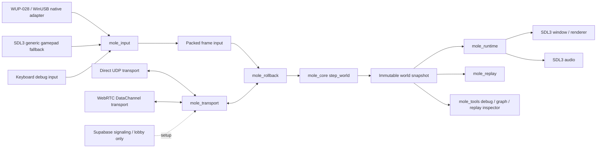

# Native Rust Rollback Architecture And Network Plan

Updated: 2026-06-05

This document is the handoff roadmap for moving Mole from the current Pygame
prototype into a native, low-latency, rollback-ready Rust platform fighter.
It is intended to be readable by a future agent or developer with no memory of
this chat.

## Executive Decision

The project should move toward this architecture:

```text
Native Rust deterministic core
  + SDL3 native runtime shell
  + GameCube/WUP-first input pipeline
  + UCF-native controller normalization
  + custom rollback core shaped by GGRS/GGPO
  + direct UDP first
  + WebRTC DataChannel later
  + Supabase only for lobby/signaling/matchmaking
```

The existing Pygame layer should stop being the long-term mechanics authority.
It can remain as a playable harness and historical reference while the Rust
core becomes the one source of truth for state transitions, physics, input
interpretation, replay, and rollback.

## Current Project State

The repository currently has two gameplay surfaces:

- The legacy playable Pygame prototype: `RealMainFile.py`, `Characters.py`,
  `ChooseAction.py`, `GatherInputs.py`, `NativeWupInput.py`, and related files.
- The newer Rust workspace: `crates/mole_core`, `crates/mole_input`,
  `crates/mole_rollback`, `crates/mole_replay`, `crates/mole_transport`,
  `crates/mole_signaling`, and `crates/mole_runtime`.

Important existing docs:

- `docs/superpowers/specs/2026-05-27-rust-rollback-core-design.md`
- `docs/research/melee-input-state-reference.md`
- `docs/research/melee-common-state-inventory.md`
- `docs/research/mole-state-coverage-comparison.md`
- `docs/research/pygame-movement-logic-pass.md`
- `docs/architecture/visual-asset-and-state-graph-migration.md`

The current docs already agree on the strategic direction:

- Rust core is cleaner long term.
- Pygame is a temporary testing surface.
- GameCube controller state should be preserved in native packet shape first.
- UCF-style handling should happen before the engine consumes input.
- Motion-state parity matters more than ad hoc behavior patches.
- Environmental collision parity belongs in Rust as well: stage geometry,
  platform collision, floor/ceiling/wall contact, ledge/cliff behavior, and
  ECB-style contact rules should migrate from the Pygame prototype into
  deterministic core/runtime boundaries shaped by Melee decomp behavior.

See [Visual Asset And State Graph Migration](./visual-asset-and-state-graph-migration.md)
for the current preserved asset and state graph inventory.

## Non-Negotiables

1. Fixed simulation rate is 60 Hz.
2. Local input must feel immediate.
3. No default gameplay input buffer.
4. The deterministic core must not depend on rendering, audio, controller APIs,
   sockets, files, wall-clock time, threads, random OS state, or global mutable
   runtime state.
5. Runtime code may drop visual frames, but it must not mutate authoritative
   gameplay outside the core step.
6. Rollback stores compact snapshots, frame-indexed inputs, and checksums.
7. Replays must be able to reproduce a match from initial state plus inputs.
8. Native GameCube input is the first-class controller path.
9. L/R analog trigger pressure and L/R digital bottom-out buttons remain
   distinct.
10. UCF is implemented natively in the input layer, not as a game-mechanics
    patch.
11. Melee and Slippi are behavioral references, not license-free code sources.
12. The architecture must remain no-cost to build, test, run, and share.

## External Reference Conclusions

### Dolphin And Slippi Shape

Dolphin Netplay has direct connection and traversal-server options. Dolphin's
own Netplay guide says traversal is for connectivity and does not add gameplay
latency; the base games remain peer-to-peer. The Dolphin server browser is
lobby infrastructure, not gameplay authority.

References:

- [Dolphin Netplay Guide](https://dolphin-emu.org/docs/guides/netplay-guide/)
- [Dolphin Netplay Server Browser](https://docs.dolphin-emu.org/blog/2019/04/06/netplay-server-browser/)

For controller input, Dolphin's native GameCube adapter path is also useful as
a runtime-boundary reference: it treats WUP-028 as a direct adapter rather than
a generic remapped gamepad, uses a background adapter read thread, and exposes
raw port status to the emulator/GameCube input path. Jeff Longo's adapter
reverse-engineering notes add the important origin caveat: the adapter has a
separate Origins command, but reliable synchronous origin retrieval requires
deliberate polling/reset control, so this project must keep raw samples and
origin diagnostics visible instead of letting UCF hide a bad pre-UCF layer.
The rate numbers are layer-specific: public Melee latency research describes
console controller polling as effectively about 120 Hz against a 60 Hz game
engine, while WUP-028 reverse-engineering reports 1 kHz JoyBus-side adapter
communication after polling starts. The decomp boundary still exposes one
`HSD_PadGameStatus` snapshot to fighter input for each game frame; faster
capture is a latency/input-boundary concern, not a mid-frame fighter-state
simulation rule.

References:

- [Dolphin official GameCube adapter guide](https://dolphin-emu.org/docs/guides/how-use-official-gc-controller-adapter-wii-u/)
- [Dolphin GameCube adapter source](https://github.com/dolphin-emu/dolphin/blob/master/Source/Core/InputCommon/GCAdapter.cpp)
- [Dolphin WUP-028 udev rule](https://github.com/dolphin-emu/dolphin/blob/master/Data/51-usb-device.rules)
- [GameCube adapter reverse engineering notes](https://jefflongo.dev/posts/gc-adapter-reverse-engineering/)
- [Delfinovin WUP/native adapter project](https://github.com/Struggleton/Delfinovin)

Slippi adds rollback, matchmaking, replay support, and a Dolphin fork plus
Melee-side ASM/Gecko support. Its public docs and repositories show the pieces,
but not every production matchmaking detail. The useful architectural lesson is
still clear: matchmaking and connection setup can be server-assisted, but the
match simulation and rollback live on the players' machines.
The Slippi replay spec reinforces the same input boundary: pre-frame updates are
emitted exactly once per frame per character immediately before controller input
is used for that character's next action. Slippi files can preserve processed
and some raw/UCF analog fields for that frame, but they are not high-frequency
WUP packet logs.
The public Slippi Dolphin fork also keeps netplay around small frame-indexed
pad payloads, ACKs, checksums, and delay frames. Its `SlippiPad` transfers only
the 8-byte pad data portion for a frame, batches queued inputs into one packet,
and keeps a configurable online delay that defaults to two frames. Because
Slippi lives inside Dolphin, rollback has to coexist with emulator savestate
machinery; the Rust engine should not inherit that whole-emulator burden. We
should preserve Slippi's small input/checksum/rollback shape, then snapshot only
the authoritative Mole gameplay state needed to replay whole 60 Hz frames.

References:

- [Slippi Netplay](https://slippi.gg/netplay)
- [Project Slippi repository](https://github.com/project-slippi/project-slippi)
- [Slippi replay file spec](https://github.com/project-slippi/slippi-wiki/blob/master/SPEC.md)
- [Slippi SSBM ASM repository](https://github.com/project-slippi/slippi-ssbm-asm)

### GGRS Shape

GGRS describes the exact rollback contract we want to mirror: save state, load
state, advance one frame from player inputs, exchange inputs, predict missing
remote input, roll back on mismatch, and detect desyncs with checksums.

Reference:

- [GGRS Rust docs](https://docs.rs/ggrs/latest/ggrs/)

### SDL3 Runtime Shape

SDL3 is a strong native shell for window, event, input, gamepad fallback, and
audio. The Rust `sdl3` crate exists and supports modules for audio, event,
gamepad, joystick, keyboard, render, video, and more. SDL's gamepad docs also
show why generic controllers are useful as a fallback, while our native
GameCube/WUP path remains the first-class path.

References:

- [SDL3 Rust crate](https://docs.rs/sdl3/latest/sdl3/)
- [SDL3 language bindings](https://wiki.libsdl.org/SDL3/LanguageBindings)
- [SDL3 gamepad docs](https://wiki.libsdl.org/SDL3/CategoryGamepad)
- [SDL3 audio docs](https://wiki.libsdl.org/SDL3/CategoryAudio)

### Supabase And WebRTC Shape

Supabase Realtime is WebSocket/server-mediated. It is useful for lobby,
presence, matchmaking queues, room codes, and WebRTC signaling. It should not
carry 60 Hz gameplay inputs.

The free Supabase Realtime limits are currently documented as 200 concurrent
connections and 100 messages per second. A naive two-player 60 Hz input stream
can exceed that message rate by itself.

References:

- [Supabase Realtime limits](https://supabase.com/docs/guides/realtime/limits)
- [Supabase Broadcast docs](https://supabase.com/docs/guides/realtime/broadcast)

WebRTC DataChannels can be peer-to-peer once established. They still need
signaling, and restrictive networks may require TURN relay, which is the part
that can become non-free.

References:

- [MDN WebRTC connectivity](https://developer.mozilla.org/en-US/docs/Web/API/WebRTC_API/Connectivity)
- [MDN WebRTC data channels](https://developer.mozilla.org/en-US/docs/Web/API/WebRTC_API/Using_data_channels)
- [Rust WebRTC data channel docs](https://docs.rs/webrtc/latest/webrtc/data_channel/)

## System Diagram



## Crate Boundaries

### `mole_core`

Purpose: authoritative deterministic game rules.

Owns:

- World state.
- Player state.
- Fixed 60 Hz frame stepping.
- Motion-state identities.
- State-local transition order.
- Character attributes.
- Stage/collision geometry in deterministic units.
- Physics integration.
- Checksum-friendly state representation.

Must not depend on:

- SDL3.
- WinUSB/hidapi/libusb.
- WebRTC.
- UDP sockets.
- Supabase.
- Filesystem.
- Wall-clock time.
- Threads.
- Renderer state.

Core API shape:

```rust
pub fn step_world(world: &mut World, inputs: &[PlayerInput; MAX_PLAYERS]);
pub fn checksum_world(world: &World) -> u64;
```

The exact function names can change, but the boundary should not: the core
advances only from explicit state and explicit frame inputs.

### `mole_input`

Purpose: turn physical controller state into rollback-safe per-frame input.

Owns:

- `GameCubePadStatus` raw packet shape.
- WUP-028 port mapping.
- Console-style origin capture.
- UCF-native input correction.
- Trigger analog deadzone normalization.
- Digital trigger bottom-out facts.
- Stick byte to deterministic fixed-point conversion.
- Previous/current input frame comparison.
- Packed `PlayerInput` for rollback.

Important rule: this crate can know about controller semantics, but not about
motion-state outcomes. It can expose facts such as "fresh dash direction" or
"digital L pressed this frame"; it should not decide "enter Dash state" or
"enter Guard state." The core state machine decides that.

### `mole_rollback`

Purpose: own prediction, snapshots, resimulation, and desync detection.

Owns:

- Snapshot ring buffer.
- Confirmed local/remote inputs.
- Predicted remote inputs.
- Frame cursor.
- Rollback start-frame detection.
- Resimulation forward to present.
- Checksum exchange hooks.
- Prediction policy.
- Optional input-delay setting.

Recommended first prediction policy:

- Repeat last known remote input.
- Fall back to neutral/default if no previous remote input exists.

### `mole_transport`

Purpose: move small frame-indexed packets between peers.

Owns:

- In-memory loopback transport for tests.
- Direct UDP transport.
- Transport trait/interface.
- Later WebRTC DataChannel transport.
- Packet serialization/deserialization.
- Packet versioning.
- Ping/quality stats.
- Connection lifecycle.

Must not own:

- Game physics.
- State transitions.
- Controller normalization.
- Rendering.

### `mole_signaling`

Purpose: exchange setup data for lobbies, room joins, direct endpoints, and
future WebRTC negotiation.

Owns:

- Room create and join messages.
- WebRTC offer, answer, and ICE candidate messages.
- Direct UDP endpoint exchange.
- JSON serialization for setup messages.
- Validation of required setup fields.

Must not own:

- Frame-indexed gameplay input.
- Simulation checksums.
- Rollback prediction or resimulation.
- Any 60 Hz gameplay transport.

### `mole_replay`

Purpose: make every testable match reproducible.

Owns:

- Initial session config.
- Initial world seed/state.
- Build/protocol version.
- Stage/character profile identifiers.
- Per-frame packed inputs.
- Periodic checksums.
- Desync evidence.

Replay files should be small, deterministic, and suitable for regression tests.

### `mole_runtime`

Purpose: native playable shell.

Owns:

- SDL3 initialization.
- Window.
- Renderer.
- Audio device/streams.
- Event loop.
- Generic controller fallback.
- Keyboard debug fallback.
- Native WUP polling bridge.
- Fixed-step accumulator.
- Debug overlays.

Must not own:

- Gameplay state transitions.
- Gameplay physics.
- Rollback policy.
- UCF correction rules.

### `mole_tools`

Purpose: developer and QA tooling.

Owns:

- State graph viewer.
- Replay inspector.
- Input viewer.
- Rollback/desync visualizer.
- Latency/packet debug overlays.

Rust is preferred for tooling that feeds engine data, runtime exports, or parity
checks that must stay byte/type-shaped with the Rust runtime. Existing Python
tools are legacy/reference paths and should be ported when actively extending
that pipeline. Web-based views may remain view layers over Rust-owned data.
These tools are not part of the rollback-critical runtime.

## Authoritative Model

There should be no authoritative gameplay server.

Authority is split like this:

1. Each peer is authoritative over its own local input frames.
2. The deterministic core is authoritative over the resulting world state.
3. The host is authoritative only over session setup:
   - ruleset
   - stage
   - player slots
   - initial seed/config
   - protocol version agreement
4. Once the match begins, peers are symmetrical simulation participants.

Rollback works because all peers execute the same deterministic function over
the same initial state and the same inputs. The network sends inputs, not
world-state deltas.

### Desync Handling

Peers should exchange periodic checksums. If checksums disagree:

1. Mark the session desynced.
2. Save local replay/debug bundle.
3. Show a clear error.
4. Stop ranked/authoritative result reporting for that match.

For early development, hard-stop on desync. Later, tools can compare replay logs
and snapshots to identify the first divergent frame.

### Cheating And Trust

P2P rollback is trust-light, not trustless. A malicious client can lie about
inputs or run a modified build.

Do not solve this early. The first goal is correct feel and deterministic
simulation. Later anti-cheat/ranked integrity can use:

- protocol/build version locking
- replay upload
- checksums
- suspicious timing detection
- server-verified match reports
- community moderation

## Input Architecture

### Native GameCube Path

The first-class path is:

```text
WUP-028 adapter
  -> raw USB report
  -> subframe capture-window collapse
  -> per-port GameCubePadStatus
  -> console-style origin capture
  -> PADRead-style origin subtraction
  -> HSD stick clamp / native Melee pad sample
  -> UCF-native correction
  -> deterministic packed PlayerInput
  -> rollback/core
```

`GameCubePadStatus` should preserve:

- main stick raw X/Y bytes
- C-stick raw X/Y bytes
- analog L trigger byte
- analog R trigger byte
- digital L button
- digital R button
- A/B/X/Y/Z
- Start
- D-pad directions

### Console-Style Origin Capture

GameCube controllers establish neutral/origin from the state seen during
connection/reset. For plug-and-play behavior, the runtime should capture the
first stable connected samples as origin, matching the console-style user
experience.

This origin is not a gameplay mechanic. It is controller preprocessing.

When multiple WUP reports are available before one 60 Hz core tick, the input
adapter collapses that in-memory capture window before origin/HSD/UCF
processing. USB reads must run outside the gameplay thread, following the same
broad shape as Dolphin/Slippi's GC adapter read thread; the gameplay tick should
never block trying to drain multiple hardware interrupt transfers. Latest raw
analog and trigger bytes win; digital buttons are OR-merged across the window to
preserve short edges, matching the HSD raw-queue merge shape. A newly connected
port still uses the first connected sample as its origin.

This is the input side of "sub-tick." It must match Melee's shape: higher-rate
raw capture can exist before the pad/game boundary, then the game-facing fighter
input is finalized as one `HSD_PadGameStatus -> Fighter.input` snapshot for the
60 Hz simulation frame.

Current Friend Connect singles controller ownership is deliberately local and
minimal. A machine starts with no active gameplay controller even if multiple
WUP ports are connected. The first connected local WUP/GameCube controller that
produces non-neutral gameplay input latches as that machine's active local
controller. The code-owner maps that active controller to rollback P1; the
code-connector maps it to rollback P2. Extra local controllers are ignored in
the singles playtest and should be reserved for a later local-doubles design.
This is a local-input routing rule only; it does not alter Melee-shaped
game-facing input once the controller is selected.

The rollback/runtime side may also run a higher-rate scheduler at a multiple of
60 Hz, such as 120 Hz or 240 Hz. Those sub-frame scheduler passes may receive
network packets, update prediction confidence, select the next committed local
input from the capture window, prepare a rollback, or resimulate whole 60 Hz
frames before the next visible frame is presented. They must not advance fighter
physics, action-state timers, hitboxes, ECB, damage, or animation by half-frames.
All authoritative gameplay output remains the same 60 Hz sequence that would be
produced without the higher-rate scheduler.

### Native Pre-UCF Pad Processing

The native WUP path mirrors the Melee pad stack before UCF is layered on top:

```text
raw WUP bytes
  -> PADRead-style origin subtraction
  -> HSD radius clamp / scale for main stick and C-stick
  -> optional UCF
  -> vanilla Melee input facts
```

Melee configures the HSD pad layer with stick clamp max `80` and
`scale_stick = 80`, then fighter code consumes `nml_stickX/Y` as floats. The
current compact Rust input bridge preserves rollback-friendly signed axes by
encoding that HSD normalized float into the temporary signed-127 core scale. A
physical cardinal gate near `+80` must therefore arrive at the core as full
positive stick before UCF; UCF cardinal snap is not allowed to compensate for a
bad native scale.

Do not apply the SDK `PADClamp` trigger rest band as a WUP gameplay rule.
Melee's HSD fighter-input path subtracts the trigger origin, then fighter common
data decides when analog shield pressure is meaningful. Digital L/R bottom-out
still remains separate button state.

### UCF-Native Correction

UCF should be treated as the default native controller pass. It should be
implemented in `mole_input` as a deterministic transformation from raw/current
and previous controller frames into Melee-shaped facts or rollback-owned input
amendments.

UCF cardinals and shield-drop are ordinary input translations: the core receives
a normal Melee-shaped pad sample. UCF dashback is the exception in the source:
UCF 0.84 patches `Interrupt_AS_Turn`, checks the raw two-frame x delta from the
UCF pad buffer, and then writes the Turn action-state flags that vanilla Melee
already uses (`has_turned`/`just_turned`, named `is_smash_turn`/`can_dash` in
the UCF source). The adapter owns the raw delta check and the default-on toggle;
the rollback input carries a dashback amendment bit, and the core applies it
only at the decomp Turn hook frame. Do not model this as a new movement state or
as character tuning.

Slippi replay diagnostics use the same split: game-facing replay analogs are
exported as core inputs, and UCF-tagged replay players receive adapter-owned
amendment bits derived from the recorded raw stick deltas. This makes UCF
replay comparison realistic while preserving a vanilla core transition model.

### Generic Controller Fallback

SDL3 gamepad input is a fallback for non-GameCube controllers. It should map
into the same `PlayerInput` shape but should not define the canonical feel.

GameCube/WUP remains the reference controller.

## Simulation Architecture

### Fixed 60 Hz

The simulation always advances in discrete frames:

```text
frame 0
frame 1
frame 2
...
```

Runtime timing only decides when to call the core. It does not change gameplay
results.

### Decomp-Native Numbers

Use the same value shape as the decomp for authoritative fighter state. For
Melee fighter motion this means source-shaped `f32` values, not fixed-point or
milli-integer substitutes: `Fighter_procUpdate` updates `gr_vel`,
`self_vel`, `x74_anim_vel`, `xF8_playerNudgeVel`, and `cur_pos` as floats, then
the JObj render path receives `cur_pos` through `HSD_JObjSetTranslate`.

Integer or milli-unit fields may exist only as legacy compatibility/readout
projections while the Rust codebase is being migrated. They must not become the
source of truth for gameplay, replay parity, collision, or render-root state,
and new decomp-backed work should avoid adding logic that converts source floats
to milli integers and then back again. If rollback determinism needs guardrails,
solve that around deterministic `f32` evaluation and checksums rather than by
changing Melee-authored float state into a different numeric model.

Rendering can convert source floats to pixels at the final screen transform.
Gameplay and collision should carry source floats until that boundary.

### State-Local Transitions

The state machine should mirror the Melee/decomp shape:

```text
state id
state frame
animation frame
IASA/input callback
physics callback
collision callback
end condition
```

Do not use one giant "choose best action" resolver. Each state owns an ordered
transition function. This is how we prevent accidental same-frame overwrites and
patch stacks.

When the decomp separates `Anim` and `IASA`, keep those responsibilities
separate in Rust. `IASA` callbacks are opportunistic interrupt tables gated by
state-local flags and animation frames; they are not the generic action-end
fallback. If a source `Anim` callback exits through `ft_8008A2BC`, the Rust state
must model that no-frames-remaining route to `Wait` separately from any IASA
transition. Empty IASA callbacks, such as `ftCo_LandingAir_IASA`, should stay
empty instead of borrowing another state's interrupt list.

State changes made by an earlier callback priority can affect the later physics
callback on the same 60 Hz tick. For example, `Walk_IASA -> ft_8008A244` changes
to `Wait` without clearing `gr_vel`; the subsequent physics priority then runs
the new `Wait_Phys`/`ft_80084F3C` and may apply grounded friction immediately.
Do not interpret "preserve carried `gr_vel`" as "skip same-frame source physics."

`KneeBend` takeoff is a concrete example of the required callback ordering.
`ftCo_KneeBend_Anim` may enter `JumpF`/`JumpB` on the same 60 Hz tick; the new
airborne state's IASA callback can then accept fresh airborne actions such as
`EscapeAir` or C-stick aerials, while `ftCo_Jump_Phys_Inner` still skips
ordinary air drift/gravity on that first jump tick. The Rust core should keep
that separation explicit: IASA action checks are not the same thing as physics.

ECB/contact state is also rollback-owned. Source ground-to-air transitions call
`ftCommon_8007D5D4`, set a 10-frame ECB lock, and preserve the previous
floor-contact bottom probe while the JObj-sourced desired ECB changes under the
animation. In the Rust root-coordinate model, that locked floor-contact probe is
stored as `ecb_bottom_offset_y = 0`; after the lock expires, collision resumes
sampling the generated per-action JObj ECB table. Hardcoded EscapeAir or Pass
bottom probes must not replace this path.

### Motion State Parity Rule

If a Melee mechanic depends on a named state, Mole should model that state
directly instead of hiding it behind a flag.

Near-term required movement states:

- `Wait`
- `WalkSlow`
- `WalkMiddle`
- `WalkFast`
- `Turn`
- `Dash`
- `Run`
- `RunDirect`
- `RunBrake`
- `TurnRun`
- `Squat`
- `SquatWait`
- `SquatRv`
- `KneeBend`
- `JumpF`
- `JumpB`
- `JumpAerialF`
- `JumpAerialB`
- `Fall`
- `FallF`
- `FallB`
- `FallAerial`
- `FallAerialF`
- `FallAerialB`
- `EscapeAir`
- `FallSpecial`
- `FallSpecialF`
- `FallSpecialB`
- `Landing`
- `LandingFallSpecial`
- `GuardOn`
- `Guard`
- `GuardOff`
- `EscapeN`
- `EscapeF`
- `EscapeB`

Later combat states:

- ground attack family
- aerial attack family
- landing aerial family
- grab/catch/throw/captured families
- damage/hitstun/tumble
- knockdown/tech/passive
- ledge/cliff states
- shield hit/powershield/shield break

### Directional Shield Exception

The project intentionally allows turning while shielding. This is a design
departure from Melee. It should be explicit, isolated, and rollback-owned:

- `Guard` remains Melee-shaped.
- Shield-facing-turn fields are extra Mole state data.
- The extra behavior must not collapse `GuardOn`, `Guard`, and `GuardOff`.
- Leaving shield still follows Melee-shaped shield release timing unless the
  design later changes that deliberately.

## Rollback Architecture

### Snapshot Ring

Store enough snapshots to cover the maximum rollback window plus safety margin.
Initial target:

```text
max rollback frames: 8
snapshot ring capacity: 16 or 32
```

This can change after profiling, but starting compact keeps debugging easier.

Snapshots are not full application or renderer state. They are the minimum
authoritative state needed to restore a frame and replay the same core steps
from frame-indexed inputs. Start with a plain cloneable/debuggable snapshot,
then optimize its layout after parity and checksum tests are solid.

Current implementation note: `mole_rollback::SnapshotBuffer` must store
`mole_core::WorldRollbackSnapshot`, not a cloned `World`. Restore is an
in-place operation on the current `World`, so static runtime configuration
(`StageProfile`, `MeleeCommonData`, and per-player `FighterProfile`) remains
owned by the session instead of being copied through every saved frame. The
rollback snapshot carries mutable authoritative frame/player/input/combat-log
state, including canonical Melee action-state identity and source animation
fields. When a new gameplay-authoritative field is added to `PlayerState` or
`World`, add it to the core rollback snapshot and checksum together.

The first authoritative snapshot slice should include:

- frame index and deterministic RNG/checksum state
- every active player's canonical Melee action-state id and Rust alias
- source animation frame, state frame, facing, position, velocity, acceleration,
  grounded/airborne flags, jumps, ECB/contact locks, and floor/platform refs
- Melee input snapshot fields owned by core: current/previous sticks, button
  masks, tap timers, trigger timers, and UCF amendment bits already committed
  for that frame
- damage/combat state: percent, stale/hitlag/hitstun timers, knockback,
  invulnerability/intangibility, shield, grabbed/capture/downed/passive state,
  and active hit/hurt/collision owner state
- active deterministic items/projectiles/stage actors once those become
  gameplay-authoritative

Do not include:

- SDL/window state, GPU resources, debug overlays, audio mixers, UI, filesystem
  handles, adapter threads, sockets, or raw uncommitted WUP capture buffers
- baked source-frame tables or static character/stage data that can be indexed
  by id after restore

The restore contract is stricter than "positions match." After restore and
resim, action ids, timers, velocities, collision ownership, damage state, and
checksum must match. Position-only rollback would hide desyncs until combat.

### Frame Data

For each frame, store:

- local input
- remote input if confirmed
- remote input if predicted
- prediction status
- world checksum after simulation
- optional network quality stats

### Advance Loop

Every simulation tick:

1. Run any higher-rate scheduler passes due before this 60 Hz commit.
2. Poll/collapse local controller capture as late as possible.
3. Add the committed local input for the current 60 Hz frame.
4. Drain remote packets and ACKs.
5. If remote input is missing, predict from the last known input.
6. Save the minimal authoritative snapshot before advance.
7. Advance one whole 60 Hz core frame.
8. Send queued local input packets with checksum/ACK metadata.
9. Exchange/check periodic checksums.

### Correction Loop

When a confirmed remote input arrives for an old frame:

1. Compare it against the predicted input for that frame.
2. If identical, mark confirmed and continue.
3. If different, find the snapshot before the bad frame.
4. Restore snapshot.
5. Replace predicted input with confirmed input.
6. Resimulate each frame back to present.
7. Update checksums.

Higher-rate 120/240 Hz runtime passes may perform this correction before the
next visible frame is presented, but they still restore and resimulate whole 60
Hz core frames. They do not create sub-frame fighter updates.

### Local Feel

Local input should enter the local simulation without an artificial buffer by
default. Optional input delay may exist for netplay quality settings, but it
should be explicit and visible.

Current Friend Connect uses a Slippi-shaped netplay buffer layer rather than a
delay-based simulation stall. The source anchors are:

- `.research/project-slippi-Ishiiruka/Source/Core/Core/ConfigManager.cpp`
  loads `SlippiOnlineDelay` with default `2`.
- `.research/project-slippi-Ishiiruka/Source/Core/Core/Slippi/SlippiNetplay.h`
  defines `ROLLBACK_MAX_FRAMES 7`.
- `.research/project-slippi-Ishiiruka/Source/Core/Core/Slippi/SlippiNetplay.cpp`
  queues local pads, drops ACKed pads, sends queued pad data, and exposes a
  bounded remote pad history for rollback.
- `.research/project-slippi-Ishiiruka/Source/Core/Core/HW/EXI_DeviceSlippi.cpp`
  implements the online send boundary: on the first online frame it queues
  neutral delay pads, then sends the current physical input as `frame + delay`;
  it also uses `ROLLBACK_MAX_FRAMES` as the remote lookahead/rollback window.
- `.research/project-slippi-Ishiiruka/Data/Sys/GameSettings/GALE01r2.ini`
  includes `Apply Delay to all In-Game Scenes`, which applies online delay
  outside the online scene.

The Rust translation for Friend Connect is intentionally engine-native:
gameplay starts from match frame `0` after lobby start, not from window launch
frames; local physical input uses `mole_rollback::SlippiInputDelayBuffer`, so
physical input sampled on match frame `F` is scheduled and transmitted
immediately for game frame `F + delay`; the default delay is `2`; the first
online send queues neutral pads for the initial delay window before the first
real delayed input, matching `handleSendInputs(frame == 1)`; the rollback
lookahead window is `7` frames; the newest `8` future-stamped input packets are
retransmitted as one bundled datagram ordered newest-to-oldest until peer ACKs
allow old packets to drop; ACK pruning follows Slippi's `frame < minAckFrame`
boundary, so the ACK frame itself remains available for repair; incoming
bundled remote pads use Slippi's `inputsToCopy = packetNewestFrame - headFrame`
rule, so only frames newer than the current remote head are copied into rollback
history and overlapping older bytes do not backfill holes or overwrite accepted
input; and late remote packets older than the current match frame call rollback
confirmation while a snapshot is still retained. A bundled datagram contributes
one `CalcTimeOffsetUs`-style timing sample from its newest frame rather than one
sample per included pad frame. Packets older than the retained snapshot window
are ignored for correction instead of panicking. This is a rollback/runtime
transport layer; it must not alter Melee-shaped 60 Hz fighter logic once inputs
are committed.

Friend Connect also translates Slippi's online-frame skip gate. After draining
UDP packets for the current match frame, if the newest remote input is older
than the `ROLLBACK_MAX_FRAMES` lookahead window, the runtime resends the queued
local packets without staging a new local input and without advancing
`match_frame`. This is the Rust equivalent of
`CEXISlippi::shouldSkipOnlineFrame` returning true and
`SlippiNetplayClient::SendSlippiPad(nullptr)` resending queued pads.

Friend Connect diagnostics are intentionally compact and bounded. Runtime JSONL
frame summaries include structured packet counts, rollback corrections, missing
remote frames, latest remote frame/checksum, world checksum, bundled input count,
and Slippi pacing decisions. Use
`cargo run -p mole_cli -- friend-connect diagnostics --log <path> --json` after
a local or friend internet test to summarize those logs without dumping
per-packet spam.

The runtime also translates Slippi's early online time-sync stall. Incoming pad
packets update the same kind of frame-offset sample used by
`SlippiNetplayClient::CalcTimeOffsetUs`: receive time minus half RTT, compared
against the latest local sent pad frame/time, plus the 16683 us frame delta.
Every `SLIPPI_ONLINE_LOCKSTEP_INTERVAL` (`30`) online frames through frame
`120`, an ahead client stalls when the trimmed-average offset is above
`10000` us, capped to `5` skipped frames. This is the source-backed convergence
layer that keeps a client from sitting several frames ahead merely because it is
still inside the rollback lookahead window.

After frame `120`, the Rust runtime also translates Slippi's
`shouldAdvanceOnlineFrame` pacing layer. It does not change fighter logic or the
deterministic 60 Hz frame contract. Instead it mirrors Dolphin's
`m_EmulationSpeed` boundary by scaling Friend Connect's runtime deadline from
`99.5%` to `101.0%` based on the same `CalcTimeOffsetUs` samples. When the local
instance is more than `16683 + 10000` us behind, it also honors Slippi's
far-behind advance hint: up to `3` advance hints after frame `120`, spaced at
one hint every `5` online frames. In Mole this is represented as an immediate
next runtime deadline, not as a mid-frame fighter update.

Because the repair window intentionally resends recent inputs, packets can arrive
out of order. UDP timing and ACK tracking must therefore be monotonic: an older
repair packet may fill a missing frame, but it must not move the latest observed
remote sequence or peer-ACK sequence backward. Moving those counters backward
keeps both clients retransmitting stale ranges and reads as artificial input
latency.

## Network Plan

### Layer 0: Loopback

Purpose: prove rollback without real networking.

Use for:

- unit tests
- deterministic sync tests
- local two-player harness
- rollback visualization

Exit criteria:

- two peers exchange inputs through loopback
- prediction mismatch triggers rollback
- resimulation reaches same checksum

### Layer 1: Direct UDP

Purpose: first real P2P gameplay transport.

Advantages:

- lowest overhead
- simple packet model
- no browser/runtime complexity
- matches GGRS's default shape well

Weakness:

- NAT and firewalls can block it
- direct IP/port UX is rough

Use direct UDP for:

- LAN
- direct IP testing
- early competitive-feel testing
- performance baseline

### Layer 2: Supabase Signaling

Purpose: free server-assisted connection setup, not gameplay transport.

Current Friend Connect setup uses a shared code as the room. The code-owner is
authoritative for lobby role, becomes P1, and is the only peer allowed to start
the match. The peer who enters that code becomes P2 and waits for a
`match_start` signal. Start is rebroadcast briefly so a late listener does not
miss the transition, but simulation still begins as deterministic 60 Hz P2P
rollback once both peers are connected.

Supabase can handle:

- account or anonymous identity
- online presence
- lobby list
- matchmaking queue
- room codes
- exchanging connection offers
- exchanging UDP endpoint candidates
- exchanging WebRTC SDP/ICE messages

Supabase should not handle:

- 60 Hz gameplay input packets
- authoritative state
- rollback
- per-frame simulation

Why: free-tier Realtime message limits are too low for naive gameplay packet
relay, and the server-mediated path adds avoidable latency.

### Layer 3: WebRTC DataChannel

Purpose: more plug-and-play P2P connection success.

Advantages:

- built-in ICE negotiation
- can traverse many NAT situations
- encrypted
- browser-compatible if a future web client is ever wanted

Weakness:

- heavier runtime stack
- async complexity
- SCTP/DataChannel behavior must be measured
- TURN relay may be required on restrictive networks
- TURN relay may cost money

Implementation rule: WebRTC is a transport backend under `mole_transport`.
It must not change rollback or core APIs. The first Rust spike uses an
optional `webrtc` feature and a DataChannel-shaped adapter over the existing
`InputPacket` wire format, while SDP/ICE setup data remains in
`mole_signaling`. Direct UDP remains the baseline path until a concrete
WebRTC runtime binding is connected and measured against UDP.

Current comparison status: `mole_transport::TransportTimingComparison` records
latency and jitter summaries in simulation frames. Direct UDP has the runtime
timing probe path; the WebRTC DataChannel adapter currently has only in-memory
transport contract tests and no real runtime timing samples. Until that changes,
the comparison verdict treats WebRTC as unmeasured and keeps direct UDP as the
preferred gameplay transport.

### Layer 4: Optional Relay/TURN

Purpose: connection fallback for restrictive networks.

This should not be required for the first public prototype. A truly universal
plug-and-play online game generally needs relay capacity somewhere, and relay
bandwidth is the part that can stop being free.

Future options:

- user-provided TURN server
- community-hosted relay
- low-cost relay only for failed direct P2P
- no relay, clear error message, direct-connect fallback

## Network Packet Model

Keep packets tiny and versioned.

Required early packet types:

- `Hello`
- `HelloAck`
- `SessionConfig`
- `InputFrame`
- `InputFrameAck`
- `Checksum`
- `Ping`
- `Pong`
- `Disconnect`

`InputFrame` should include:

- protocol version
- session id
- player slot
- frame number
- packed input bits/bytes
- local input sequence number
- optional last received remote frame

`Checksum` should include:

- protocol version
- session id
- player slot
- frame number
- checksum value

Do not send world state during normal gameplay. World state belongs to replay
debug tooling, not live transport.

## Versioning

Online sessions must reject incompatible versions.

Version hash should cover:

- protocol schema
- core simulation version
- character data version
- stage data version
- input/UCF version
- rollback protocol version

In early development, this can be a simple string or cargo package version plus
manual data version constants. Later it can become a generated hash.

## Milestone Roadmap

### Milestone 0: Handoff And Baseline

Goal: make the current direction unambiguous.

Deliverables:

- this architecture document
- new-chat handoff prompt
- implementation roadmap
- current test commands documented

Exit criteria:

- a fresh agent can read the docs and know not to continue the old Pygame
  hotfix spiral

### Milestone 1: Rust Core Becomes The Mechanics Authority

Goal: one local Falcon-like character can move through Rust-owned state.

Deliverables:

- explicit movement motion states
- fixed 60 Hz stepping
- deterministic position/velocity
- deterministic state-frame counters
- Falcon-like test attributes
- Battlefield-like test stage units

Exit criteria:

- Rust tests prove deterministic movement from replayed inputs
- Pygame is no longer needed to decide movement state

### Milestone 2: GameCube-First Input Contract

Goal: native WUP input produces rollback-safe packed input.

Deliverables:

- raw `GameCubePadStatus`
- origin calibration
- UCF-native pass
- trigger analog/digital separation
- C-stick and D-pad preservation
- generic SDL gamepad fallback

Exit criteria:

- input viewer shows raw, calibrated, UCF, and packed views
- core tests consume packed input only

### Milestone 3: State-Transition Parity Slice

Goal: grounded movement and shield movement feel correct because the state
machine is shaped correctly.

Deliverables:

- `Wait`
- `WalkSlow`
- `WalkMiddle`
- `WalkFast`
- `Turn`
- `Dash`
- `Run`
- `TurnRun`
- `RunBrake`
- `Squat`
- `SquatWait`
- `SquatRv`
- `KneeBend`
- `GuardOn`
- `Guard`
- `GuardOff`
- directional shield-turn extension

Exit criteria:

- dash dance, walk, pivot, moonwalk setup, shield release, and jump out of
  shield are driven by state-local transitions
- no generic "choose action" resolver owns these mechanics

### Milestone 4: SDL3 Native Local Runtime

Goal: a player can launch the native Rust version and test movement locally.

Deliverables:

- SDL3 window
- fixed-step loop
- simple renderer
- WUP input polling
- SDL gamepad fallback
- keyboard debug fallback
- debug overlay

Exit criteria:

- local build runs without Pygame
- closing the window exits all runtime/helper processes

### Milestone 5: Replay And Checksum Infrastructure

Goal: every local test can become a deterministic regression case.

Deliverables:

- replay writer
- replay reader
- initial session config
- input stream
- periodic checksums
- replay playback test harness

Exit criteria:

- a saved input sequence reproduces the same final checksum
- state-transition bugs can be captured as replay files

### Milestone 6: Offline Rollback And Sync Tests

Goal: rollback works before real networking exists.

Deliverables:

- snapshot ring
- predicted input history
- confirmed input replacement
- restore/resimulate path
- sync test mode
- desync detection tests

Exit criteria:

- intentionally wrong prediction rolls back and catches up
- two local peers converge on the same checksum

### Milestone 7: Direct UDP 1v1

Goal: first true peer-to-peer rollback over a network.

Deliverables:

- direct IP/port connect
- UDP transport implementation
- input packet exchange
- checksum exchange
- ping display
- basic disconnect handling

Exit criteria:

- two local machines can play a simple 1v1 session over LAN/direct IP
- rollback is observable and stable

### Milestone 8: Supabase Signaling

Goal: make connection setup friendlier without making Supabase gameplay
authority.

Deliverables:

- room code or lobby prototype
- presence
- matchmaking queue spike
- endpoint/offer exchange
- fallback to direct IP if service unavailable

Exit criteria:

- players can discover/connect without manual IP exchange
- gameplay packets remain P2P

### Milestone 9: WebRTC Transport

Goal: improve NAT traversal and optional browser-compatible signaling without
changing the core.

Deliverables:

- WebRTC DataChannel transport backend
- Supabase-based SDP/ICE exchange
- latency/jitter comparison against UDP
- failure-mode diagnostics

Exit criteria:

- WebRTC sessions can run the same rollback API as UDP
- UDP remains available as a baseline

### Milestone 10: Combat And Full Match Expansion

Goal: expand from movement parity to game completeness.

Deliverables:

- Melee-shaped environmental collision and stage contact rules
- attack states
- hit detection
- hitstun/damage
- tumble/knockdown/tech
- ledge/cliff
- stock/match flow
- audio events
- visual effects

Exit criteria:

- replay/checksum tests cover combat
- online sessions remain deterministic

## Testing Strategy

### Unit Tests

Use for:

- input byte conversion
- UCF correction
- trigger deadzone mapping
- packed input serialization
- state transition order
- physics constants
- collision helper functions

### Contract Tests

Use for:

- deterministic stepping
- snapshot save/load
- rollback correction
- replay reproduction
- transport loopback delivery

### Sync Tests

Use for:

- two simulated peers
- different packet arrival schedules
- dropped input packets
- delayed remote inputs
- prediction mismatch

### Human QA

Use for:

- dash dance
- walk and light walk
- pivot
- moonwalk
- wavedash/waveland
- shield release
- jump out of shield
- directional shield turn
- trigger analog/digital behavior

Human feel tests are valuable, but any discovered bug should be reduced into a
replay or deterministic test once understood.

## Performance Policy

Optimize for:

- low input latency
- small deterministic state
- cheap snapshots
- low allocation during frame stepping
- simple packet formats
- predictable CPU cost

Avoid early:

- ECS frameworks in the authoritative core
- dynamic dispatch in tight simulation paths unless measured safe
- runtime reflection for gameplay state
- server-authoritative networking
- large JSON packets for gameplay
- browser runtime as the primary shell
- visual interpolation feeding back into gameplay

Profiling should happen before complex optimization. The first optimization is
architecture: deterministic core, tiny input packets, compact snapshots, and
clean boundaries.

## Licensing Policy

Dolphin, Slippi, UCF, and Melee decomp sources are references. Do not copy GPL
or incompatible source directly into this project unless the project makes an
explicit license decision.

The default approach is clean-room implementation of observable behavior:

1. document the behavior
2. write tests for the behavior
3. implement independent Rust code
4. cite references in docs

## Rules For Future Agents

Do:

- read this document first
- recognize the repository as `Robbiemas/First_Game`
- use the `handoff/rust-rollback-architecture` branch for this migration work
- use `gh` and normal `git` CLI commands for GitHub operations
- avoid the Codex GitHub plugin/connector tools for this project unless the user explicitly says they are working again
- treat Rust core as the future authority
- keep Pygame changes minimal and temporary
- preserve GameCube controller semantics
- make state transitions explicit
- write tests before mechanics changes
- keep networking transport separate from rollback
- keep Supabase out of gameplay packets
- keep WebRTC as a transport backend, not a runtime mandate

Do not:

- use the Codex GitHub plugin/connector tools for repository operations
- continue patching Pygame as the real engine
- create generic movement hacks for specific techniques
- collapse Melee-shaped states into flags when state identity matters
- put SDL/window/audio/controller code inside `mole_core`
- send world state every frame
- make a server authoritative over gameplay
- require paid infrastructure for the first online path

## Immediate Next Work

The next implementation should start with Milestone 1 and Milestone 2 in Rust:

1. Split `Walk` into explicit `WalkSlow`, `WalkMiddle`, and `WalkFast` or
   equivalent explicit motion-state metadata.
2. Ensure `Wait -> WalkSlow/WalkMiddle/WalkFast` is owned by the Rust core.
3. Ensure input facts are derived from rollback-owned previous/current input.
4. Add replay/checksum tests for the new movement slice.
5. Make the live runtime render Rust snapshots instead of duplicating movement
   rules in Pygame.

This is the clean launch point for a new chat.
